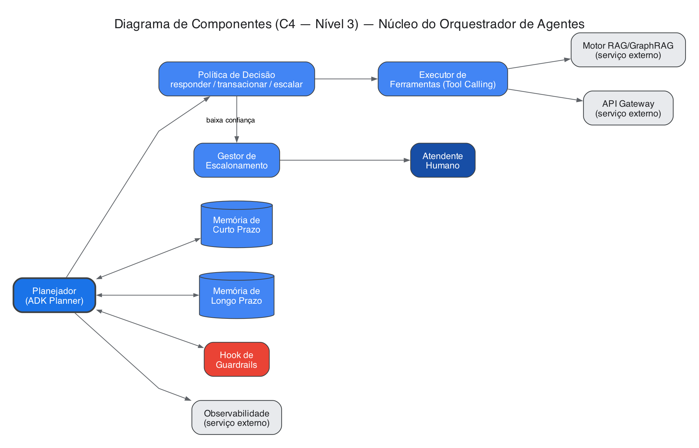
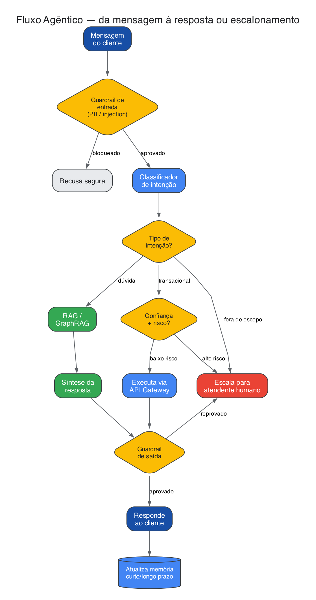
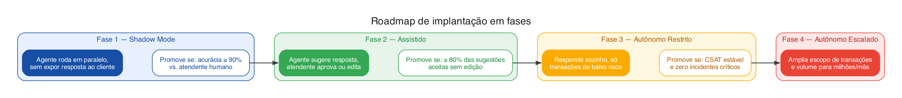

# Apêndices — Material de apoio
### Assistente Agêntico de Relacionamento | Banco Carrefour

**Autor:** Israel Moreira
**Documento complementar à proposta principal** — sem limite de página, pensado como referência pra sessão de perguntas.

---

### Apêndice A — Diagrama de Componentes (C4 — Nível 3)

### Apêndice B — Fluxo agêntico (diagrama completo)

### Apêndice C — Roadmap de fases (diagrama)

### Apêndice D — Exemplos de produtos e transações de referência

- **Consultas de conhecimento:** política de aumento de limite do Cartão Atacadão, condições do crediário Carrefour, cobertura do seguro prestamista.
- **Transações automatizáveis desde a Fase 3:** 2ª via de fatura, consulta de limite, bloqueio/desbloqueio de cartão.
- **Fora do autônomo mesmo em fases avançadas:** contestação de compra, aumento de limite, empréstimo pessoal, Pix acima de limiar de risco.

### Apêndice E — Prós e contras por opção

| Decisão | Opção | Prós | Contras |
|---|---|---|---|
| Orquestração | ADK em Agent Engine | SLA bancário, autoscaling sem operação própria, nativo do Gemini Enterprise | Custo por execução |
| Orquestração | LangGraph self-hosted em GKE | Flexibilidade total de pipeline, útil pra time com padrão próprio | Time opera infra e integração com Gemini por conta própria |
| Banco | Cloud Spanner | Vetor + grafo no mesmo motor, escala horizontal nativa | Custo mais alto que Postgres self-hosted em baixo volume |
| Banco | PostgreSQL + pgvector + Neo4j | Custo baixo, familiar pra maioria dos times | Dois motores a operar, escala manual |
| LLM | Gemini via Vertex (Flash-Lite/Pro) | Sem retenção de dado pra treino, custo previsível, zero infra | Custo por token em volume muito alto |
| LLM | Gemma/Llama self-hosted (vLLM) | Custo marginal baixo só em alto volume | GPU ociosa em baixo volume, exige expertise de serving |
| API Gateway | Apigee | Governança madura, bom pra múltiplas áreas do banco | Licenciamento caro pra um piloto isolado |
| API Gateway | Kong OSS | Custo baixo, suficiente pro contrato do piloto | Governança corporativa mais limitada sem plugins pagos |
