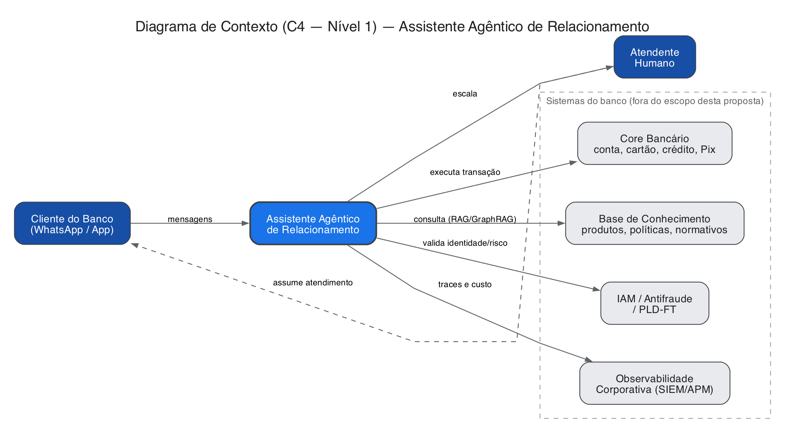
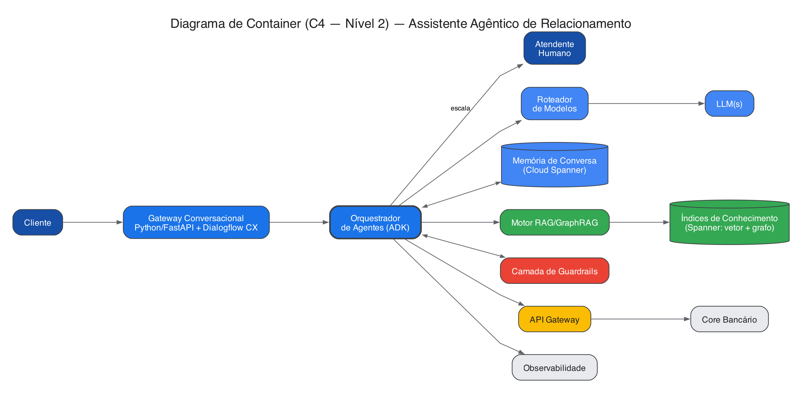

# Proposta de Arquitetura - Assistente Agêntico
### Desafio Técnico — Arquiteto de Soluções Especialista em IA

**Autor:** Israel Moreira **Data:** Outubro/2026

---

## Sumário executivo

Precisamos atender 2 requisitos, criar um assistente agêntico em produção no Motor de Relacionamento com o Cliente, e tornar esse piloto um blueprint replicável pra outras áreas do banco.

Decido construir em cima do **Google Cloud / Vertex AI**. A empresa provavelmente já opera nesse ambiente, e os planos corporativos do Vertex isolam o dado dentro do nosso próprio perímetro (VPC-SC, sem retenção pra treino de terceiros) — isso facilita aprovação de compliance e remove uma camada inteira de risco de integração. Nesse nível, é uma decisão de plataforma institucional, não de "paga vs. open source".

"Blueprint reutilizável" aqui não significa portabilidade de nuvem — significa nascer em **componentes com contrato bem definido** (canal, orquestração, conhecimento, guardrails, integração), que outra área consiga **reconfigurar pra um caso de uso diferente** sem reescrever a base. Onde faz sentido, aponto a alternativa open source de cada componente — não pra trocar de nuvem, mas porque um outro time pode preferir montar alguma peça diferente, e o blueprint precisa admitir isso.

Escopo do piloto: dúvidas sobre produtos e um conjunto pequeno de transações reversíveis de baixo risco (2ª via de fatura, bloqueio de cartão, consulta de limite). Mexeu com valor relevante, crédito ou contrato, fica fora do autônomo nesta fase.

---

## 1. Arquitetura de solução

### 1.1 Diagrama de Contexto (C4 — Nível 1)

### 1.2 Diagrama de Container (C4 — Nível 2)

*(Nível 3 — Componentes do núcleo agêntico — no Apêndice A.)*

### 1.3 Decisões principais

**Build vs. buy.** O runtime de execução é comprado (Agent Engine, no **Gemini Enterprise Agent Platform** — rebrand 2026 do Vertex AI Agent Builder, reunindo ADK, Agent Engine e 200+ modelos — [docs](https://docs.cloud.google.com/gemini-enterprise-agent-platform/overview)); a política de decisão e os guardrails do banco são construídos. Resultado: menos tempo de implementação.

**Modelo único vs. multi-modelo.** Roteamento por complexidade — FAQ e consulta simples no modelo mais barato, raciocínio multi-passo no modelo maior, ambos via API gerenciada (sem self-hosting; justificativa de custo na seção 5).

**Orquestração.** O orquestrador segue um **padrão nativo do ADK**: agente coordenador com sub-agentes especializados, compostos via `SequentialAgent`/`sub_agents` com estado de sessão compartilhado ([docs](https://adk.dev/agents/multi-agents/)) — configuração sobre o framework, não código do zero. Times que preferirem outro pipeline podem usar **LangGraph** (orquestração como grafo de estados — [docs](https://langchain-ai.github.io/langgraph/)), também compatível com Gemini via API. A reusabilidade do blueprint está nos contratos entre camadas (seção 6), não na ferramenta de orquestração.

### 1.4 Componentes por camada

| Camada | Opção paga/gerenciada | Opção open source |
|---|---|---|
| Canal | [Dialogflow CX](https://cloud.google.com/dialogflow/cx/docs) (fluxos de conversa multicanal) + [WhatsApp Cloud API](https://developers.facebook.com/documentation/business-messaging/whatsapp/about-the-platform) (oficial Meta) | Gateway próprio em FastAPI + mesma WhatsApp Cloud API |
| Orquestração | ADK em Agent Engine (seção 1.3) | ADK/LangGraph self-hosted em [GKE](https://cloud.google.com/kubernetes-engine/pricing) (K8s gerenciado) |
| LLM | **Gemini 3.5 Flash-Lite** + **Gemini 3.1 Pro** via [Vertex AI](https://cloud.google.com/vertex-ai/generative-ai/pricing) — preços seção 5 | Gemma 3/Llama via [vLLM](https://docs.vllm.ai/) (serving em GPU) — **não-primária**, só alto volume |
| Memória + RAG/GraphRAG | **Cloud Spanner** — [vetor](https://docs.cloud.google.com/spanner/docs/vector-search-overview) + [grafo](https://docs.cloud.google.com/architecture/gen-ai-graphrag-spanner) nativos, [pricing](https://cloud.google.com/spanner/pricing) | Postgres+[pgvector](https://github.com/pgvector/pgvector)+[Neo4j](https://neo4j.com/docs/) — **não-primária** |
| Integração transacional | [Apigee](https://cloud.google.com/apigee/pricing) (governança/analytics) | [Kong](https://developer.konghq.com/gateway/) + [Temporal](https://docs.temporal.io/) (retry automático) |

Escolhi o Spanner em vez do AlloyDB porque ele unifica vetor e grafo no mesmo banco gerenciado — um motor a menos pra operar, e menos superfície de integração (ver nota de FinOps). A opção open source (Postgres+pgvector+Neo4j) fica documentada como alternativa viável, não como primária: é a rota de um time que, por exigência própria, não puder rodar no Spanner.

**Sobre o API Gateway:** cumpre duas funções: (1) **contrato único** com os sistemas legados; (2) **revalidação independente da política de risco** antes de encaminhar ao core, via regras determinísticas (Open Policy Agent/Rego), nunca um modelo generativo. Se reprovar, a chamada nunca chega ao core bancário — filtro diferente e posterior ao guardrail de entrada da seção 3.

---

## 2. Fluxo agêntico

O agente segue um ciclo *plan → act → observe* com guardrail de entrada e saída em volta de cada etapa. Em ordem: guardrail de entrada → classificação de intenção → conhecimento ou transação → guardrail de saída → resposta ou escalonamento. *(Diagrama completo no Apêndice B.)*

**Planejamento e tool use.** O coordenador ADK (seção 1.3) decompõe a mensagem em passos — nem sempre um só: "qual o limite do meu Cartão Atacadão e dá pra aumentar" vira (1) consulta de limite via API, (2) consulta de política de aumento via RAG, (3) síntese combinando os dois. Cada passo é uma chamada de ferramenta tipada, nunca uma ação livre.

**Memória de curto prazo** é o buffer da sessão atual. **Memória de longo prazo** (Spanner, seção 1.4) guarda preferências e contexto entre sessões — nunca segredo de autenticação, só referências.

**Responder com conhecimento vs. executar transação.** Decisão de uma política explícita, não do LLM sozinho: combina intenção classificada, confiança do classificador e risco da ação (tabela de risco por tipo de transação, versionada fora do prompt). Pra essa etapa — decisão estruturada, não geração de texto — vale avaliar modelos de decisão especializados (ex.: **Jev**, da TypeSafe AI — [docs](https://docs.typesafe.ai/models)), ordens de grandeza mais baratos que um LLM generativo pra classificar.

**Escalonamento** nunca é um "não entendi" seco: o gestor de escalonamento chama uma **API de handoff** do sistema de atendimento que o banco já usa (ex.: criação de ticket/transferência de conversa via REST), levando histórico completo, intenção identificada e motivo da escalada — o atendente não parte do zero.

---

## 3. Guardrails, segurança e compliance

| Risco | Opção paga/gerenciada | Opção open source |
|---|---|---|
| Prompt injection / jailbreak | [Model Armor](https://docs.cloud.google.com/model-armor/overview) — serviço do Google Cloud que inspeciona o prompt antes de chegar ao LLM | [NeMo Guardrails](https://github.com/NVIDIA-NeMo/Guardrails) — framework open source da NVIDIA pra programar regras ("rails") em volta de um LLM |
| Vazamento de PII | [Sensitive Data Protection](https://cloud.google.com/sensitive-data-protection/docs) (ex-Cloud DLP, *Data Loss Prevention*) — detecção/mascaramento nativo do Google Cloud | [Microsoft Presidio](https://microsoft.github.io/presidio/) — biblioteca open source pra detectar e anonimizar dado pessoal em texto |
| Alucinação | Grounding nativo do RAG Engine, com referência obrigatória à fonte | Guardrail customizado usando Ragas (seção 4) como verificador de *faithfulness* pós-geração |
| Vazamento de dado sensível **via RAG** | Tag de sensibilidade no índice bloqueia o chunk antes do LLM + varredura de PII na resposta final (Sensitive Data Protection) | Mesmo desenho em dois passos, com Presidio |
| Ação indevida | Catálogo de ferramentas fechado (ADK) + política de risco revalidada de forma independente no API Gateway | Mesmas duas camadas, replicadas no ADK self-hosted e no gateway Kong |

Quatro decisões não-negociáveis nesse domínio:

1. **O agente nunca escreve direto no core bancário** — toda transação passa pelo API Gateway, que revalida a política de risco independente do que o agente decidiu (seção 1.4).
2. **A base de conhecimento pode conter informação que não deve ir pro cliente** (ex.: documento interno indexado por engano). Por isso a resposta nunca cita o documento-fonte com precisão — usa referência genérica ("em nossos termos de uso..."). A rastreabilidade exata fica só na auditoria interna, nunca na resposta ao cliente.
3. **RBAC** (controle de acesso por papel) em cada camada: o agente só tem permissão de leitura na base de conhecimento e de chamada nas ferramentas explicitamente registradas — nunca escrita direta em banco ou acesso a sistema fora do catálogo de tools.
4. **Trilha de auditoria append-only**, separada do banco operacional, gravando entrada, contexto recuperado, ferramentas chamadas, decisão de guardrail e resposta final — atende tanto o direito de explicação da LGPD (Art. 20) quanto a exigência de rastreabilidade de instituição financeira (Resolução CMN 4.658).

Dado pessoal só entra no prompt depois do guardrail de PII decidir o que é estritamente necessário (minimização de dados). Pedido de falar com humano ou contestar uma decisão do agente é escalonamento de prioridade alta.

---

## 4. Avaliação e observabilidade

**Offline, na prática:** um dataset golden vive como planilha/CSV versionado, com curadoria conjunta de produto e jurídico. A cada mudança de prompt, modelo ou índice, um pipeline de CI roda esse dataset e calcula métricas de *faithfulness* (o quanto a resposta se sustenta no conteúdo recuperado), relevância e precisão de contexto, via [Ragas](https://docs.ragas.io/) ou o [serviço de avaliação gerenciado](https://docs.cloud.google.com/gemini-enterprise-agent-platform/models/evaluation-overview) do Gemini Enterprise. Resultado cai automaticamente num dashboard — métrica abaixo do limiar bloqueia o deploy. Mais um conjunto de red-teaming rodando como teste de regressão.

**Online:** amostragem de conversas reais pra revisão humana (maior no início, decrescendo com a confiança), CSAT pós-atendimento, taxa de escalonamento, thumbs up/down.

**Observabilidade/traces:** [painel nativo de Model Observability](https://docs.cloud.google.com/gemini-enterprise-agent-platform/models/model-observability) (integra com Cloud Monitoring) ou [Langfuse](https://langfuse.com/docs) self-hosted — plataforma open source que cobre tracing e evals na mesma ferramenta, compatível com **OTLP** (*OpenTelemetry Protocol*, padrão aberto de telemetria — é o formato que garante que esses traces conversem com o SIEM/APM corporativo sem conector proprietário).

O que olho dia a dia: latência por etapa, custo por interação, e **drift** tratado com três sinais combinados — queda de CSAT, subida de escalonamento, queda de faithfulness nas evals contínuas. Qualquer um sozinho vira falso positivo fácil; os três subindo juntos é sinal real.

---

## 5. FinOps e escalabilidade

**Premissas (50 mil conversas/mês):** ~5 turnos/conversa, ~1.200 tokens de entrada e ~220 de saída por turno. Roteamento: 75% resolvido com Gemini 3.5 Flash-Lite, 25% precisa do Gemini 3.1 Pro em ao menos um turno. Preços oficiais em [cloud.google.com/vertex-ai/generative-ai/pricing](https://cloud.google.com/vertex-ai/generative-ai/pricing): Flash-Lite US$ 0,25/US$ 1,50 por milhão de tokens (entrada/saída), Pro US$ 2,00/US$ 12,00 (contexto ≤200K) — valores vigentes em outubro/2026, sujeitos a reajuste.

| Item | Trilha gerenciada (Vertex AI) | Trilha open source (não-primária) |
|---|---|---|
| Tokens LLM (com context caching) | ≈ US$ 360/mês (≈ US$ 430 sem cache) | — (custo embutido na GPU) |
| Classificação/roteamento (Jev) | ≈ US$ 3/mês — ver seção 2 | — |
| Compute do modelo | incluído no preço por token | GPU dedicada (1x A100 40GB via vLLM) ≈ US$ 2.700–3.700/mês fixo |
| Banco (memória + vetor + grafo) | Cloud Spanner ≈ US$ 650–950/mês ([pricing](https://cloud.google.com/spanner/pricing), 1 nó Standard ≈ US$ 0,90/h) | Postgres+pgvector+Neo4j self-hosted ≈ US$ 400–650/mês |
| API Gateway | Apigee ≈ US$ 1.000–1.500/mês ([pricing](https://cloud.google.com/apigee/pricing)) | Kong OSS ≈ US$ 150–300/mês |
| Guardrails + DLP | ≈ US$ 200–400/mês | NeMo/Presidio, infra ≈ US$ 100–150/mês |
| Observabilidade | parcial incluído + add-on ≈ US$ 300–500/mês | Langfuse self-hosted ≈ US$ 100–200/mês |
| **Total/mês** | **≈ US$ 2.500 – 3.800** | **≈ US$ 3.400 – 5.500** (rota secundária) |
| Por conversa | ≈ US$ 0,05 – 0,08 | ≈ US$ 0,07 – 0,11 |

**Vale self-hostear modelo pequeno?** Não, no volume deste piloto — via API, só há ganho de custo em self-hostear a partir de 500 mil–1 milhão de conversas/mês, quando a GPU dedicada fica bem utilizada. O roteamento usa **dois modelos Gemini via API, nenhum self-hosted**; a trilha self-hosted é contingência de alto volume ou soberania de dado, não desenho primário.

**Cache semântico.** Hook nativo do ADK (`before_model_callback` — [docs](https://adk.dev/callbacks/)) busca similaridade num cache [Redis](https://redis.io/docs/latest/integrate/google-adk/semantic-caching/) antes do LLM; achando match, devolve direto. TTL curto (24h).

**Escalando pra milhões:** gateway e orquestrador são stateless, escalam horizontalmente sem mudança de desenho. Atenção ao Spanner (já desenhado pra escala horizontal) e à integração (rate limiting e circuit breaker pros sistemas legados).

---

## 6. Reusabilidade e papel do CoE

**Aceleradores — cada um uma peça isolada e publicável, não "o assistente inteiro":**

- **Camada de guardrails** — container (Artifact Registry) ou pacote Python com as regras do banco sobre Model Armor/NeMo Guardrails. Outro time importa, não reimplementa detecção de PII do zero.
- **Template de agente ADK** — repositório-esqueleto com o padrão coordenador + sub-agentes já plugado a guardrails e observabilidade; a squad clona e troca ferramentas/base de conhecimento.
- **Pipeline de evals** — template de CI (Cloud Build) reutilizável; outro time só troca o dataset golden.
- **Conectores padronizados** — APIs REST com contrato OpenAPI comum; cada sistema legado ganha um adaptador fino, registrado no API Gateway. Integração vira "escrever um adaptador", não "um projeto".
- **Dashboard de observabilidade** — template Looker Studio no mesmo schema de dados (Langfuse/BigQuery); cada time clona e aponta pro próprio projeto.

**Como o CoE opera:** modelo federado — define guardrails mínimos obrigatórios e padrões documentados, sem aprovar caso a caso cada decisão de produto. Intake via portal com SLA de triagem, capacitação via workshop + pairing nas primeiras semanas. Métrica de sucesso: tempo até o primeiro shadow mode — meta realista é semanas, não meses.

---

## 7. Roadmap e riscos

| Fase | O que muda | Critério de promoção (observável via seção 4) |
|---|---|---|
| 1. Shadow mode | Roda em paralelo, sem expor resposta | Acurácia ≥ 90% vs. atendente humano — medido pelas evals offline contra o dataset golden |
| 2. Assistido | Sugere resposta, atendente aprova/edita | ≥ 80% das sugestões aceitas sem edição — direto do log de aprovação |
| 3. Autônomo restrito | Responde sozinho, só baixo risco | CSAT estável + zero incidentes críticos — painel de observabilidade e alertas de guardrail |
| 4. Autônomo escalado | Amplia escopo e volume | Indicadores sustentados + FinOps dentro do orçamento — mesmos dashboards, em volume |

*(Diagrama no Apêndice C.)* Na prática, cada critério de promoção é um número que já existe nos painéis da seção 4 — a decisão de avançar de fase é uma reunião de revisão olhando pro mesmo dashboard, não uma auditoria nova.

**Top 3 riscos arquiteturais:** (1) **alucinação em contexto regulatório** — mitigo com grounding obrigatório, guardrail de faithfulness e fallback pra "vou confirmar" em vez de resposta incerta; (2) **prompt injection levando a ação não autorizada** — mitigo com guardrails de entrada/saída e, principalmente, a política de risco revalidada no API Gateway; (3) **degradação silenciosa de custo/qualidade conforme escala** — mitigo com orçamento de custo por conversa com alerta automático e os três sinais de drift da seção 4.

**Desafios esperados:** qualidade da base de conhecimento (RAG herda os problemas da documentação-fonte); sistemas legados do core bancário (latência, picos de tráfego que o core não foi desenhado pra absorver); gestão de mudança com o time de atendimento humano (por isso as fases 1 e 2 mantêm o atendente no circuito desde o início); fragmentação de padrões conforme outras áreas adotam o blueprint sem um CoE com dentes de verdade.

